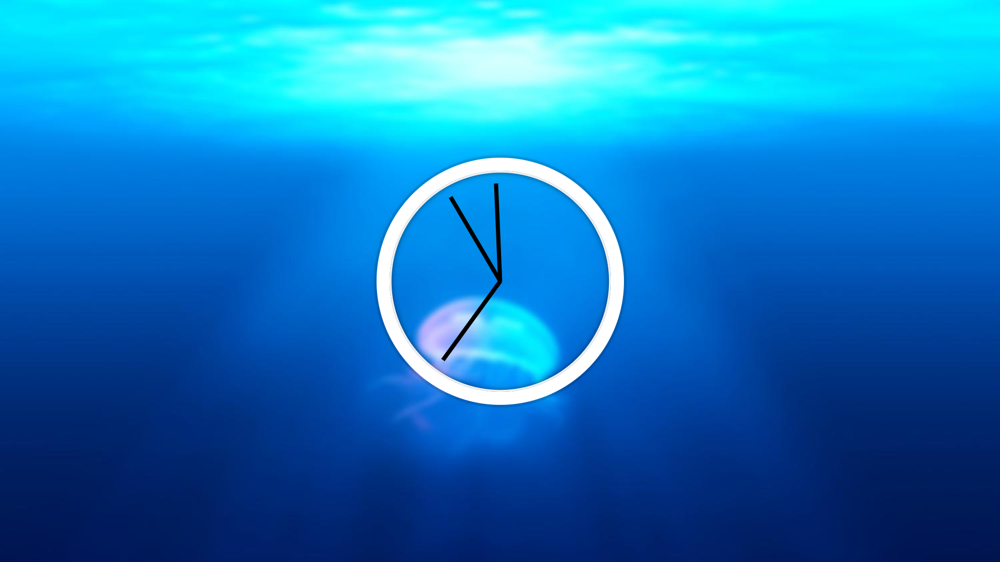

     

# Clock
A Javascript powered clock face displaying the current time.

#### [Deployed App](https://clauries.github.io/Clock/)

## Concept
As a developer I want to have a clockface in my code library so that I can easily add it as a feature on future projects.

## Usage
1. Download or clone code.
2. Open html in your favorite browser.
3. Verify time is correct. 

## Tech Utilized
* HTML
* CSS
* Javascript

## Credits
This app was built through a tutorial by Wes Bos in his series, [#JavaScript30](https://JavaScript30.com). Please check out his [website](https://wesbos.com/) or this specific [tutorial](https://youtu.be/xu87YWbr4X0).

## License

The majority of this code is not my own. I followed a tutorial. Please contact [Wes Bos](https://wesbos.com/contact/) for licensing.
